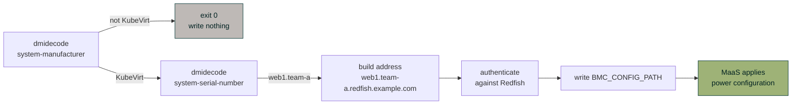

# 5. Add the commissioning script

This is the piece that breaks the chicken-and-egg problem: MaaS needs power configuration to
commission a machine, but the thing that supplies it only runs during commissioning.

## Configure it

Open `scripts/31-kubevirt-redfish-bmc.py` and set three values at the top:

```python title="scripts/31-kubevirt-redfish-bmc.py"
REDFISH_DOMAIN = "redfish.example.com"   # must match the Kyverno-generated Ingress
BMC_USER = "admin"
BMC_PASS = "CHANGE-ME"                   # must match the policy's generated Secret
```

## Upload it

```bash
maas login admin http://<MAAS_IP>:5240/MAAS "$(sudo maas apikey --username admin)"
maas admin node-scripts create script@=scripts/31-kubevirt-redfish-bmc.py
```

!!! warning "Snap confinement — do not upload from `/tmp`"
    The MaaS snap has a private `/tmp`, so `script@=/tmp/foo.py` fails with
    `[Errno 2] No such file or directory` even though the file plainly exists. Upload from your
    home directory.

Confirm the tags:

```console
$ maas admin node-scripts read type=commissioning | \
    jq -r '.[]|select(.name|test("kubevirt"))|"\(.name) \(.tags)"'
31-kubevirt-redfish-bmc ["bmc-config","enlisting","node"]
```

!!! danger "Both tags are load-bearing"
    **`bmc-config`** is what makes MaaS export `BMC_CONFIG_PATH` and apply what the script writes
    as the machine's power configuration.

    **`enlisting`** is what makes MaaS deliver the script during enlistment at all. MaaS filters
    the script tarball to `default=True OR tags contains "enlisting"`, and `default=True` is
    reserved for MaaS's own built-in scripts. Without the `enlisting` tag your script is never
    sent to the machine — it does not run, does not fail, and does not appear in the commissioning
    results. The machine simply enlists with no power configuration and everything looks fine.

## What it does



It writes a small YAML document that MaaS reads back:

```yaml
power_type: "redfish"
power_address: "web1.team-a.redfish.example.com"
power_user: "admin"
power_pass: "..."
node_id: "1"
```

## Your physical machines are safe

The script is numbered `31` so it runs *after* MaaS's built-in `30-maas-01-bmc-config`, and three
independent properties keep real hardware untouched:

1. **It exits immediately on anything that is not a KubeVirt VM.** KubeVirt sets the SMBIOS
   manufacturer to the literal string `KubeVirt`; a Dell, HPE or Supermicro machine returns at
   status 0 having written nothing.
2. **No write means no change.** MaaS only applies power configuration if a `bmc-config` script
   actually writes to `BMC_CONFIG_PATH`. The built-in behaves identically — it writes only when it
   detects a BMC. So whatever IPMI detection found on a physical machine is left alone.
3. **There is no code path** in which it can overwrite a physical machine's discovered credentials.

??? note "Why not use MaaS's `for_hardware:` field instead?"

    `for_hardware:` limits a script to matching hardware, which sounds ideal. But MaaS evaluates
    it against hardware it *already knows about*, which it does not reliably have on a machine's
    **first** enlistment — and first enlistment is the only chance this script gets. A
    `for_hardware` miss means the VM never gets power configuration at all.

    The in-script guard runs every time and is deterministic. If you would rather it never even
    execute on physical machines, add `# for_hardware: system_vendor:KubeVirt` to the metadata
    block and re-test the first-enlistment path specifically.

??? note "Test the guard yourself"

    You can prove the physical-machine behaviour without any hardware, by faking `dmidecode`:

    ```bash
    T=$(mktemp -d); mkdir -p "$T/bin"
    cat > "$T/bin/dmidecode" <<'EOF'
    #!/bin/sh
    case "$2" in
      system-manufacturer)  echo "Dell Inc." ;;
      system-serial-number) echo "J7X2M13" ;;
    esac
    EOF
    chmod +x "$T/bin/dmidecode"

    BMC_CONFIG_PATH="$T/out.yaml" PATH="$T/bin:$PATH" \
      python3 scripts/31-kubevirt-redfish-bmc.py

    [ -s "$T/out.yaml" ] && echo "BUG: wrote config" || echo "correct: wrote nothing"
    ```

## A note on the reachability check

The script tries to reach the Redfish endpoint and reports the result, but **does not** refuse to
write if it fails.

That is deliberate. The script runs inside the ephemeral commissioning environment, which sits on
the provisioning VLAN and uses MaaS as its resolver. MaaS's power operations run from the **rack
controller** — different host, different network, different resolver. Only the rack controller's
reachability matters. Blocking on a check from the wrong network breaks working automation.

Set `STRICT_BMC_CHECK = True` if you want the opposite behaviour.

---

**Next:** [Create your first VM →](06-first-vm.md)
