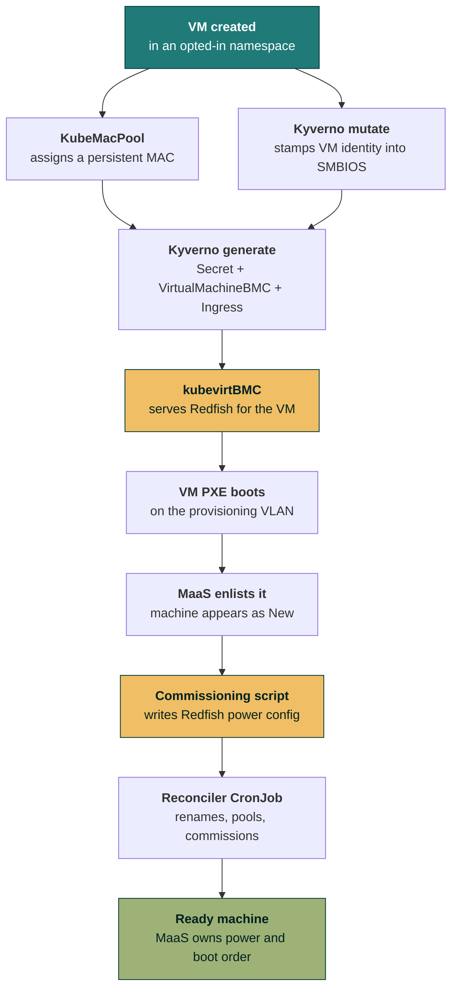

# MaaS-managed KubeVirt VMs

Create a virtual machine in Kubernetes. A few minutes later it appears in **MaaS** as a
commissioned, `Ready` machine — with working power control, the right name, and filed under its
tenant's resource pool.

Nobody typed a MAC address, created a BMC, or clicked *Commission*.

That matters because MaaS is built to manage *physical* servers. It expects a machine to PXE boot,
to have a BMC it can power-cycle over Redfish or IPMI, and to keep the same identity across
reboots. A KubeVirt VM has none of those things by default. This project gives it all of them.

---

## The flow



<div class="step-grid">
  <div class="step-card">
    <div class="n">Step 1</div>
    <div class="t">Identity</div>
    <div class="d">A persistent MAC, and the VM's <code>name.namespace</code> written into the SMBIOS serial so it can identify itself later.</div>
  </div>
  <div class="step-card">
    <div class="n">Step 2</div>
    <div class="t">A BMC</div>
    <div class="d">A Redfish endpoint per VM, published over TLS, so MaaS can power it on and set its boot device.</div>
  </div>
  <div class="step-card">
    <div class="n">Step 3</div>
    <div class="t">Enlistment</div>
    <div class="d">The VM network-boots, MaaS discovers it, and a commissioning script hands MaaS the BMC details.</div>
  </div>
  <div class="step-card">
    <div class="n">Step 4</div>
    <div class="t">Ready</div>
    <div class="d">A reconciler names the machine after the VM, files it in a tenant pool, and commissions it.</div>
  </div>
</div>

---

## What each piece does

| Component | Runs where | Job |
|---|---|---|
| **KubeMacPool** | Cluster | Assigns a MAC that survives VM restarts. Without it the MAC changes every power cycle and MaaS loses the machine. |
| **Kyverno** | Cluster | One `mutate` rule stamps identity into SMBIOS; three `generate` rules create the BMC credential, the `VirtualMachineBMC`, and the Redfish Ingress. |
| **kubevirtBMC** | Cluster | Turns a `VirtualMachineBMC` into a real Redfish service that can power the VM on/off and set its boot device. |
| **Commissioning script** | MaaS | Runs inside the machine during enlistment, works out which VM it is, and writes the Redfish power configuration back to MaaS. |
| **Reconciler CronJob** | Cluster | Renames the machine to match the VM, creates and assigns a per-namespace resource pool, and commissions anything still sitting in `New`. |

---

## Why it is built this way

??? note "Why the SMBIOS serial, and not the hostname?"

    The Redfish endpoint is per-VM (`<vm>.<namespace>.redfish.example.com`), so the commissioning
    script has to know which VM it is running on. During commissioning the hostname is a
    MaaS-generated name like `famous-marten` — useless.

    KubeVirt's `firmware.serial` is a free-form string that reaches SMBIOS, so a Kyverno mutate
    rule writes `<vm>.<namespace>` there. Inside the machine that reads back as:

    ```console
    $ dmidecode -s system-serial-number
    web1.team-a
    ```

    Using `<vm>.<namespace>` rather than just the VM name means two tenants can both run a VM
    called `web1` without colliding.

??? note "Why a commissioning script, and not an API call from Kubernetes?"

    MaaS needs power configuration in order to power a machine on for commissioning — but the
    thing that supplies that configuration only runs *during* commissioning. The only place to
    break that circle is the commissioning that happens automatically at **enlistment**, when the
    machine has PXE-booted itself and is already running.

    MaaS supports exactly this: any script tagged `bmc-config` gets a `BMC_CONFIG_PATH` to write
    to, and MaaS applies the result as the machine's power configuration. That is the same
    mechanism MaaS's own IPMI detection uses.

??? note "Why a polling reconciler, and not an event hook?"

    MaaS has no outbound webhooks — the API exposes `events` (read-only, pollable) and
    `notifications` (UI banners), and neither can call out.

    Enlistment is also asynchronous: a VM might PXE boot seconds or hours after it is created,
    so there is no point in the Kubernetes flow where you can synchronously say "now go rename the
    MaaS machine". A small converging loop is the honest design.

??? note "Why does the VM not power itself on?"

    The PXE template ships `runStrategy: Manual`, so a new VM is created powered-off — exactly
    like a physical server arriving in a rack. Boot it once and the rest is automatic.

    `runStrategy` is only a starting value in any case: kubevirtBMC drives power by writing that
    field directly (`ResetType=On` → `Always`, `ForceOff` → `Halted`), so MaaS takes ownership of
    it from the first power operation onward.

---

## Get started

<div class="grid cards" markdown>

- :material-rocket-launch: **[Deployment guide](guide/index.md)** — soup to nuts, from prerequisites to your first `Ready` machine.
- :material-sitemap: **[How it works](reference/how-it-works.md)** — the mechanism in detail, with the failure modes.
- :material-lifebuoy: **[Troubleshooting](reference/troubleshooting.md)** — the things that silently do nothing, and how to spot them.

</div>
