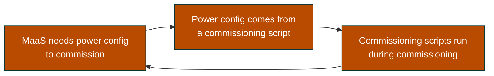

# How it works

## The circle that has to be broken

MaaS manages physical servers by power-cycling them through a BMC. To commission a machine it
powers it on, boots an ephemeral image, runs scripts, and powers it off.

That requires power configuration. But a machine that has just been discovered has none — and the
thing that could supply it (a commissioning script) only runs *during* commissioning.



The way out is **enlistment**. When a machine PXE boots and MaaS has never seen it, MaaS enlists
it and — if `enlist_commissioning` is on — runs commissioning scripts immediately. At that moment
the machine is *already running*, powered on by something other than MaaS. That is the one window
in which a script can hand MaaS the power configuration it will need from then on.

## Identity

The Redfish endpoint is per-VM, so the script must know which VM it is running on. Three
candidates, two of which do not work:

| Source | Works? | Why |
|---|---|---|
| Hostname | ✗ | During commissioning it is a MaaS-generated name like `famous-marten` |
| MAC address | ✗ | Would require a lookup service the script cannot reach |
| **SMBIOS serial** | ✅ | Set by KubeVirt's `firmware.serial`, readable with `dmidecode` |

A Kyverno `mutate` rule writes `<vm>.<namespace>` into `firmware.serial` at admission. KubeVirt
passes it through to the guest's SMBIOS:

```console
$ virsh dumpxml vms_web1 | sed -n '/sysinfo/,/\/sysinfo/p'
  <sysinfo type='smbios'>
    <system>
      <entry name='manufacturer'>KubeVirt</entry>
      <entry name='serial'>web1.vms</entry>
      <entry name='family'>KubeVirt</entry>
    </system>
  </sysinfo>
```

That single record does double duty — `serial` identifies the VM, and `manufacturer` is what keeps
the script away from physical hardware.

Using `<vm>.<namespace>` rather than just the VM name means two tenants can each run a `web1`.

## Why the MAC must be persistent

KubeVirt generates a **random MAC for every VMI**. Since MaaS power-cycling destroys and recreates
the VMI, the MAC changes on every power operation — so the machine that boots is a stranger to
MaaS, never phones home, and commissioning dies at the 30-minute timeout with every script showing
`Aborted / exit=None`.

KubeMacPool's mutating webhook writes a MAC into the VM spec at creation, where it persists.

!!! note "The README is out of date"
    KubeMacPool's README implies it needs OVS-CNI, or only supports masquerade binding. Tested
    directly: a `bridge` interface on a **Multus** NAD gets a pool MAC assigned and honoured. It
    needs Multus, not OVS-CNI.

## Why `generate` and not a mutating webhook

A mutating webhook can only modify the object being admitted. It cannot create the three sibling
objects each VM needs — the credential Secret, the `VirtualMachineBMC`, and the Ingress.

Kyverno `generate` rules do exactly that, with `synchronize: true` so they are restored if edited,
and cleanup when the VM is deleted.

`generateExisting: true` matters too: generate rules normally fire only on an admission event, so
any VM that predates the policy — including every VM on a cluster where this is installed after
the fact — would silently never get a BMC.

??? warning "Kyverno's RBAC is deliberately minimal"

    Any resource kind a policy **generates** must be granted through an **aggregated** ClusterRole,
    or the policy is rejected at admission:

    ```
    requires permissions list,get for resource v1/Secret
    ```

    ```yaml
    labels:
      rbac.kyverno.io/aggregate-to-background-controller: "true"
      rbac.kyverno.io/aggregate-to-admission-controller: "true"
      rbac.kyverno.io/aggregate-to-reports-controller: "true"
    ```

    Aggregation is not instant and the controllers cache permissions — restart the Kyverno
    deployments after creating the role.

??? warning "A generate rule's `match` block is immutable"

    Changing which resources a policy targets — say `namespaces: [vms]` to a `namespaceSelector` —
    is rejected:

    ```
    changes of immutable fields of a rule spec in a generate rule is disallowed
    ```

    This bites hardest under a GitOps or Palette-style reconciler, which will retry the rejected
    patch forever and leave the pack in `Error` permanently. The fix is delete-and-recreate, not
    update. Design the selector to be stable up front.

## Power and boot order

kubevirtBMC implements more of Redfish than you might expect.

**Power** is driven by writing `spec.runStrategy` directly — not through the start/stop
subresources:

| Redfish action | Effect on the VM |
|---|---|
| `ResetType: On` | `runStrategy: Always` — VMI created |
| `ResetType: ForceOff` | `runStrategy: Halted` — VMI removed |

A consequence worth knowing: a template's `runStrategy` is only an initial value. It cannot
"fight" MaaS, because a MaaS power-off rewrites the field itself.

**Boot order** works too. MaaS PATCHes the ComputerSystem on power-on:

```json
{"Boot": {"BootSourceOverrideEnabled": "Once", "BootSourceOverrideTarget": "Pxe"}}
```

and kubevirtBMC rewrites the VM's `bootOrder` to match:

| Override target | Resulting bootOrder |
|---|---|
| `Pxe` | disk 2, NIC 1 |
| `Hdd` | disk 1, NIC 2 |

So these VMs really do behave like hardware — MaaS asks for a one-time PXE boot and gets one.

## Why the reconciler polls

MaaS has **no outbound webhooks**. The API exposes `events` (read-only, pollable) and
`notifications` (UI banners); neither can call out.

Enlistment is asynchronous anyway — a VM might PXE boot seconds or hours after creation — so there
is no moment in the Kubernetes flow at which you could synchronously act. A converging loop is the
honest design.

It does three things, all idempotent, and only ever to machines whose `power_address` matches
`<vm>.<namespace>.<domain>`:

1. **Rename** to `<vm>-<namespace>`. MaaS hostnames are unique across the whole MaaS while a VM
   name is only unique within its namespace, so the namespace is always included — otherwise the
   first tenant to enlist would claim the bare name.
2. **Pool** — create a resource pool named after the namespace and move the machine into it.
3. **Commission** anything still in `New`. Never touches `Ready`, `Deployed`, `Commissioning` or
   `Failed`, so a machine that fails commissioning is left for a human rather than retried forever.

??? note "Why the reconciler and not the commissioning script?"

    Two reasons. MaaS's `bmc-config` contract only reads *power* configuration back out of
    `BMC_CONFIG_PATH` — there is no channel there for names or pools. And the ephemeral
    environment has no admin API credentials; embedding a key would ship it to every enlisting
    machine, physical ones included.

    For commissioning specifically there is a third reason: while the script runs, the machine is
    *in* `Commissioning`, and MaaS rejects a commission request in that state. The machine does
    not reach `New` until after the script's lifetime has ended.
